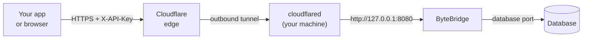

# ByteBridge

<a href="#support-the-project"></a>

A small, authenticated HTTP API in front of your databases, so they
can be reached from outside the machine through a tunnel such as
Cloudflare Tunnel — without exposing the database port or touching the
router.

It runs on **Windows**, as a service with a desktop control panel, and
on **Linux**, as a systemd service you set up from the terminal. You add
your database connections (in the window, or with the `bytebridge`
command), turn the ones you want Online, and the gateway serves them as
JSON over `127.0.0.1`. `cloudflared` runs on the same machine and
forwards to it.



Nothing listens on your LAN and no inbound port is opened: `cloudflared`
dials out to Cloudflare, and the gateway itself only ever binds to
loopback.

**Requirements:** 64-bit Windows 8.1 or later, or a 64-bit Linux with
systemd; and a database server — Firebird 4 (default port 3050) or
PostgreSQL (5432). Both are tested against a real server, and both hold
`/query` read-only themselves. See
[Database engines](docs/reference/database-engines.md).

**Not a developer?** The [picture guide](docs/guide/README.md) walks
through setting ByteBridge up step by step, with no technical
background needed — also [in Arabic](docs/ar/README.md). In the app,
**Help → User Guide** (or **F1**) opens it.

## Install on Windows

Grab an installer from the
[latest release](https://github.com/kenanwahbeh/ByteBridge/releases/latest).

| File | .NET | Use it when |
| ---- | ---- | ----------- |
| `ByteBridge-<version>-x64-setup.exe` | included | **Start here.** Normal desktop install. |
| `ByteBridge-<version>-x64.msi` | included | Group Policy, Intune, or a scripted rollout. |
| `ByteBridge-<version>-x64-framework-setup.exe` | fetched | Much smaller download; Setup installs the runtime if the machine lacks it. |
| `ByteBridge-<version>-x64-framework.msi` | required | Scripted rollout where the runtime is managed separately. |

The `-framework` builds need the
[.NET 10 Desktop Runtime (x64)](https://dotnet.microsoft.com/download/dotnet/10.0);
the `-framework` **.exe** downloads and installs it when it is missing,
while the `.msi` expects your deployment tool to handle it. The bundled
builds need nothing else installed.

Both `.exe` installers also offer to install `cloudflared`, skipping the
offer when it is already present. That gets you the connector; pointing
it at a tunnel still needs your own token, which is the whole point —
see [GATEWAY.md](GATEWAY.md).

Every file also carries a signed statement of where it was built, which
the GitHub CLI can check before you run anything:

```
gh attestation verify ByteBridge-<version>-x64-setup.exe --repo kenanwahbeh/ByteBridge
```

Requires 64-bit Windows 8.1 or later. All installers are per-machine
and ask for administrator rights once.

### Silent install

Both `.exe` installers accept Inno Setup's standard silent switches:

```
ByteBridge-<version>-x64-setup.exe /VERYSILENT /SUPPRESSMSGBOXES /NORESTART
```

The `.msi` files install unattended the standard MSI way:

```
msiexec /i ByteBridge-<version>-x64.msi /quiet /norestart
```

In silent mode, missing prerequisites (the .NET Desktop Runtime,
`cloudflared`) are downloaded and installed automatically instead of
prompting — there is nobody to answer a prompt during an unattended
rollout.

### Updating

ByteBridge checks GitHub for a newer release about once a day and shows
a banner in the control panel when there is one. **Update now** downloads
the installer that matches your install, checks it against the release's
checksums, and starts it once you agree. It never installs anything by
itself. Linux uses `apt` as usual. The daily check can be turned off
(`update off`), and `update check` asks on demand. See
[Updates](docs/reference/updates.md).

## Install on Linux

On Debian and Ubuntu, add the signed apt repository once; after that
`apt install` and `apt upgrade` do the rest:

```
sudo install -d -m 0755 /etc/apt/keyrings
curl -fsSL https://kenanwahbeh.github.io/ByteBridge/bytebridge.asc | sudo tee /etc/apt/keyrings/bytebridge.asc >/dev/null
echo "deb [arch=amd64 signed-by=/etc/apt/keyrings/bytebridge.asc] https://kenanwahbeh.github.io/ByteBridge stable main" | sudo tee /etc/apt/sources.list.d/bytebridge.list
sudo apt update
sudo apt install bytebridge
```

The key's fingerprint is on
[the repository's page](https://kenanwahbeh.github.io/ByteBridge/).
Each release also carries the `.deb` itself and a `linux-x64` tarball
with an `install.sh` for other distributions, with checksums in
`SHA256SUMS-linux.txt` and the same build attestation as the Windows
files. The package starts a systemd service, `bytebridge`, and installs
the `bytebridge` command to configure it. There is no control panel on
Linux. The [Linux guide](docs/getting-started/linux.md) has the details.

## It runs as a service

The gateway is a Windows service, `ByteBridge`, installed and started
for you (on Linux, a systemd service, `bytebridge`). It starts with the
machine and serves with nobody signed in, so an unattended server is a
supported target and closing the window does not take the gateway down
with it.

The window is a control panel for that service. It shows two things
separately, because they are not the same: whether Windows is running
the service, and whether the gateway is actually answering, which it
checks by calling `/health` over loopback. A running service whose
gateway could not bind is exactly what is behind a `502`, so it is
named rather than reported as healthy.

It asks for administrator rights, because
`C:\ProgramData\ByteBridge` holds your database passwords beside the
API key, and that key is all that stands between the public internet
and those databases. The secrets are encrypted at rest with a key that
never leaves the machine, but on the running machine any administrator
can still read them, so the folder is restricted to Administrators and
the service account, and no other account on the machine can read it.

### Linux

There is no window, so everything is done with the `bytebridge`
command, which runs as the service account:

```
bytebridge status
bytebridge db add --name Sales --server 127.0.0.1 --path /data/sales.fdb --user SYSDBA --password secret
bytebridge key show
bytebridge port 8080
```

Data lives in `/var/lib/bytebridge`, readable by the service account
only. Changes apply within a few seconds, without a restart.
`bytebridge --help` lists everything.

### Windows Server Core

Server Core has no desktop, so the control panel cannot run there. The
service executable doubles as an admin tool:

```
ByteBridge.Service.exe status
ByteBridge.Service.exe db add --name Sales --server 127.0.0.1 ^
    --path C:\data\sales.fdb --user SYSDBA --password secret
ByteBridge.Service.exe key show
ByteBridge.Service.exe port 8080
```

Changes apply within a few seconds; the service does not need
restarting. Run `ByteBridge.Service.exe --help` for the full list. On a
machine with a desktop you never need any of this.

## Quick start

1. **Add a database.** Choose **File → New Database…**, fill in the
   database server, port, user, password and database path or alias,
   and use **Test Connection** before saving. (On Linux:
   `bytebridge db add`, as above.)
2. **Check it is Online.** A connection saved after a successful test
   is Online straight away, and only Online connections answer
   requests. The button on its card takes it **Offline** and back; going
   Online tests the connection first and stays Offline if that fails.
3. **Check the gateway.** The status line under the menu bar should
   read *● Answering — http://127.0.0.1:8080 · Service: running*. Open
   **Web Server** from the menu bar and press **Copy API Key**. (On
   Linux: `bytebridge status`, and `bytebridge key show` for the key.)
4. **Start the tunnel.**

   ```
   cloudflared tunnel --url http://127.0.0.1:8080
   ```

   Or let ByteBalance make the tunnel for you: **Connect to ByteBalance**
   in the window, or `enroll --email you@example.com` on the command
   line (Windows and Linux). See
   [Connecting to ByteBalance](docs/reference/bytebalance.md).

5. **Confirm the whole path.** `/health` needs no key, so it is the
   first thing to try:

   ```
   curl https://<your-hostname>/health
   ```

   ```json
   { "status": "ok", "service": "ByteBridge", "connections": 1, "online": 1, ... }
   ```

6. **Query.**

   ```bash
   curl -X POST https://<your-hostname>/query \
     -H "X-API-Key: <your key>" \
     -H "Content-Type: application/json" \
     -d '{ "database": "Sales", "sql": "SELECT ID, NAME FROM CUSTOMERS WHERE ID = @id", "parameters": { "id": 42 } }'
   ```

## The API

| Method | Path | Auth |
| ------ | ---- | ---- |
| GET | `/health` | no |
| GET | `/databases` | yes |
| POST | `/query` | yes — `SELECT` / `WITH` only |
| POST | `/execute` | yes — only while **Allow writing** is on, otherwise `403` |

[**GATEWAY.md**](GATEWAY.md) has the request and response shapes, the
Firebird-to-JSON type mapping, the status codes, a named-tunnel
`config.yml`, and a troubleshooting section.

## Security

The tunnel makes this reachable from the public internet, so treat the
API key as a database credential.

- Every endpoint except `/health` requires the key, in `X-API-Key` or
  as `Authorization: Bearer`. It is 32 random bytes, generated on first
  run and compared in constant time. When Cloudflare login is set up in
  ByteBridge, a valid session from that login is accepted instead on
  every endpoint but `/stats`, which always needs the key. Cloudflare
  Access in front of the tunnel is a separate layer and does not replace
  that check.
- **New Key** rotates it without restarting the gateway. The running
  gateway picks the new key up within a few seconds, and from then on
  every client still sending the old one is refused.
- A caller that sends too many wrong keys is refused with `429` and a
  `Retry-After` for a while, before its key is even compared.
- Send values in `parameters`, never concatenated into `sql`; they are
  bound as database parameters, so a value cannot become SQL.
- ByteBridge only reads until an administrator ticks **Options → Allow
  writing**. `/query` refuses anything that is not a `SELECT` or `WITH`
  either way, and runs what it accepts in a transaction that the
  database engine itself holds read-only, so a statement sent to it
  cannot change rows. Firebird generators change outside transactions,
  so `GEN_ID` with a step other than 0 and `NEXT VALUE FOR` are refused
  as well; a procedure that moves one inside its own body can only be
  stopped by limiting the database user. While writing is off, `/execute` answers `403`. While
  it is on, anyone holding the API key, or signed in through ByteBridge's
  Cloudflare login, can run any statement: change and delete data and
  change the structure of your databases. Cloudflare Access in front of
  the tunnel is an extra layer, not a replacement for the key. Leave
  writing off unless you need it, and turn it off again afterwards.
- The listener binds to `127.0.0.1` only, and a request body over 1 MB
  is refused.
- Anything holding the key can read whatever the database user of an
  Online connection can read. If the data is sensitive, put
  [Cloudflare Access](https://developers.cloudflare.com/cloudflare-one/policies/access/)
  in front of the hostname as well, so callers are authenticated at
  Cloudflare's edge before a request reaches the machine at all.
  [GATEWAY.md](GATEWAY.md#locking-the-tunnel-to-just-you) has the setup.
- Every request, served or rejected, is appended to
  `C:\ProgramData\ByteBridge\logs\` (on Linux,
  `/var/lib/bytebridge/logs/`). Bound parameter values are never
  written; the statement is.

Connections are stored in
`C:\ProgramData\ByteBridge\bytebridge.db` (on Linux,
`/var/lib/bytebridge/bytebridge.db`). Database passwords and the
API key are encrypted with a key that never leaves the machine and is
kept *outside* the data folder — DPAPI on Windows; on Linux an
owner-only key file in `/var/lib/bytebridge-keys`, a sibling of the
data folder — so a copy of the data folder alone, from a backup or a
stolen file, opens nothing. A full-machine image (a disk clone, a VM
snapshot) still contains both halves on either OS and stays
decryptable, so treat those images as credentials too. And on the
running machine itself an administrator can still unwrap the secrets,
which is why the folder stays restricted. See
[Moving to a new machine](docs/reference/security.md#backups-and-moving-to-a-new-machine)
for backup and recovery guidance.

## Build from source

Needs the .NET 10 SDK and Windows — the control panel is WPF. The rest
of the solution builds on Linux too, which is how CI runs the tests.

```
dotnet build ByteBridge.slnx
dotnet run --project app/ByteBridge.csproj
```

**How the projects fit together**, and where a change belongs, is in
[docs/developers/architecture.md](docs/developers/architecture.md).

The gateway service alone also builds and runs on Linux:

```
dotnet publish service/ByteBridge.Service.csproj -c Release -r linux-x64 --self-contained -o publish
sudo ./publish/install.sh
```

To produce the installers the way the release does, see
[`.github/workflows/release.yml`](.github/workflows/release.yml). WiX
and Inno Setup both only run on Windows.

## Contributing

Want to help build ByteBridge? Start with
[CONTRIBUTING.md](CONTRIBUTING.md) — it covers the build, the tests, and
the conventions a pull request is expected to follow.

| | |
| --- | --- |
| [ROADMAP.md](ROADMAP.md) | What is being worked on, and what is deliberately not |
| [docs/developers/architecture.md](docs/developers/architecture.md) | How the projects fit together, and where a change belongs |
| [docs/decisions/](docs/decisions/) | Why the project is the way it is — the reasoning a rebuild cannot re-derive |

ByteBridge is a standalone product, with ByteBalance as an optional
integration. That is
[decided, and the reasoning is written down](docs/decisions/0001-standalone-product.md);
the roadmap follows from it.

## Tests

```
dotnet test tests/ByteBridge.Tests
```

The suite drives the gateway over a real socket on a spare port, with
its settings in a temporary folder, so it never reads or overwrites the
connections of whoever is running it.

| Area | What it covers |
| ---- | -------------- |
| `GatewayServerTests` | Routing, the API key, CORS, body validation, the read-only guard, the size cap, and that an early reply leaves the connection usable. |
| `GatewayLifecycleTests` | Start, stop, restart, a port already in use, key rotation, and connection changes taking effect without a restart. |
| `SqliteDatabaseTests` | Storage, duplicate details and names, gateway settings including the loopback-only host, and a key rotation surviving another writer's save. |
| `FirebirdExecutorTests` | The read-only guard on its own, including comments, word boundaries and unterminated blocks. |
| `FirebirdIntegrationTests` | A real server end to end: type mapping, NULLs, UTF-8, parameter binding, the row cap, writes, and concurrency. |
| `DatabaseTypeTests` | Engine names, each engine's usual port, connection keys, and a settings file from before engines existed opening as Firebird. |
| `EngineAndSecretsTests` | The engine column and secret protection together: a PostgreSQL password still wrapped, a pre-engine file migrating both, and a row naming an engine this build lacks still reading. |
| `PostgreSqlIntegrationTests` | PostgreSQL end to end against a real server: types, NULLs, parameter binding, the row cap, the engine refusing an INSERT and a second statement, sequences untouched, and `/execute` both ways. |
| `CliTests` | The Server Core commands: status, on and off, the port, showing and replacing the key, and adding, enabling, disabling and removing a database. |
| `EnrollmentApiTests`, `EnrollmentFlowTests`, `EnrollmentCommandsTests`, `EnrollmentAddressTests` | Connecting to ByteBalance: the control plane's endpoints and status codes, the flow from request to approval, the commands, and which addresses are accepted. |
| `EnrollmentConnectorTests` | Installing and removing the `cloudflared` connector on both systems: `sc.exe` on Windows, `systemctl` and a root-only token file on Linux, and the token never appearing in an error. |
| `CloudflareSettingsTests`, `CloudflareAccessValidatorTests`, `OAuthLoginTests`, `EdgeAccessTests` | Cloudflare login and Access: the settings, validating the token against Cloudflare's real key format, the login redirects, and "only requests that came through Access". |
| `SecretProtectionTests` | The passwords and API key wrapped at rest: round trip, files from before the wrapping, no double wrapping. |
| `WritingSwitchTests` | Read-only by default, and `/execute` refused until an administrator turns writing on. |
| `SecurityHardeningTests`, `AdversarialInputTests` | The failed-key limiter against a clock the test moves, and hostile input thrown at every endpoint. |
| `ConnectionHealthMonitorTests`, `GatewayStatsTests` | `/databases` reporting a connection as online only when it is, and the per-connection request counts. |
| `WizardDecisionTests`, `WindowsLayerTests` | The add/edit wizard's decisions and the Windows-specific layer, both reached from `core` so the suite can test them. |
| `RequestLogTests` | The log file itself: one JSON line per request, parameter values kept out, long statements truncated, concurrent writes, and pruning old files. |
| `RequestLoggingTests` | The log as the running gateway fills it: served and refused requests, the statement and connection, the forwarded client address, and every request landing exactly once under load. |
| `SharedDatabaseTests` | The settings file open in two processes at once: WAL mode, one seeing what the other wrote, a write waiting for a lock, and both writing together. |

`FirebirdIntegrationTests` is skipped unless you point it at a server,
so a fresh clone still gets a green run:

```powershell
$env:BYTEBRIDGE_TEST_FIREBIRD = "127.0.0.1:3050:SYSDBA:masterkey:C:\db\test.fdb"
dotnet test tests/ByteBridge.Tests
```

It creates its own `EFS_TEST_CUSTOMERS` table and works only on rows it
owns, but point it at a scratch database rather than anything real.

`PostgreSqlIntegrationTests` works the same way, and has its own CI job:

```powershell
$env:BYTEBRIDGE_TEST_POSTGRES = "127.0.0.1:5432:postgres:password:shop"
dotnet test tests/ByteBridge.Tests --filter Category=PostgreSql
```

[CI](.github/workflows/ci.yml) runs on every push and pull request: the
build and the whole suite on `windows-latest`, where the live tests skip
for want of a server, and — on `ubuntu-latest` — the Firebird tests and
the PostgreSQL tests against each engine in a service container, and a
Linux publish job that builds the `.deb`, installs it with `apt`, and
checks the service starts under systemd and answers `/health`. CodeQL
scans every change. The test project targets plain `net10.0`, so it runs
on Linux unchanged even though the control panel is Windows-only.

Changes to the Linux packaging also run the
[apt repository workflow](.github/workflows/apt-repo.yml), which builds
the signed repository and installs from it, without publishing.

## Versioning

Version numbers are [semantic](https://semver.org/): `MAJOR.MINOR.PATCH`.
For this app that means:

| Bump | When |
| ---- | ---- |
| **MAJOR** | Something that breaks an existing caller: an endpoint or response field removed or renamed, a response shape changed, the authentication scheme changed, or a settings file an older version can no longer read. |
| **MINOR** | New behaviour an existing caller can ignore: a new endpoint, an extra response field, a new option in the window, a new database engine. |
| **PATCH** | Fixes and internal work with no visible change to the API or the UI. |

Anything worth mentioning goes into [CHANGELOG.md](CHANGELOG.md) under
**Unreleased** as it is made, so cutting a release is never a
remembering exercise.

## Releasing

`main` is protected, so a release goes through a pull request like any
other change. The full procedure is in
[docs/contributing/versioning-and-releasing.md](docs/contributing/versioning-and-releasing.md);
in short:

1. Check that the **Unreleased** section of
   [CHANGELOG.md](CHANGELOG.md) describes what is about to ship.
2. Promote it without committing, then open a pull request:

   ```
   scripts/new-release.ps1 -Version x.y.z -NoCommit
   ```

   That turns Unreleased into `## [x.y.z]` with today's date, opens a
   fresh Unreleased section and rewrites the comparison links. It
   refuses to run on an empty Unreleased section, an existing tag, or a
   version that is not semantic, and it pushes nothing. Commit the
   changelog as `Release x.y.z`, open the pull request and merge it.
3. Tag the merge commit and push the tag:

   ```
   git tag vx.y.z <merge-commit>
   git push origin vx.y.z
   ```

   The tag starts the release workflow. One job builds the four
   installers on Windows; the next builds the Linux `.deb` and tarball.
   Between them they copy that version's changelog section into the
   release body, write `SHA256SUMS.txt` and `SHA256SUMS-linux.txt`,
   attest every file, and attach everything to a GitHub Release. A tag
   whose version has no changelog section fails the build rather than
   publishing a release with no notes.
4. When the release succeeds, the apt repository workflow rebuilds the
   signed repository from the `.deb` files of the last five releases,
   refusing any whose attestation does not name this repository's
   release workflow and its own tag, and publishes it on GitHub Pages.

To test the packaging without publishing anything, run the **Release**
workflow manually from the Actions tab. It builds the same installers
and Linux packages, prints the release body it would have used, and
leaves the files as workflow artifacts — no tag, no release.

## Support the project

ByteBridge is free and stays free. If it is useful to you, you can
support the work that keeps it going: maintenance, testing against real
Firebird servers, documentation, and the next round of improvements. It
is entirely optional, and nothing in the app is held back from people
who skip it.

**Binance Pay.** Scan this in the Binance app. It is an in-app code, so a
general-purpose QR reader or a desktop browser will not open it — the
Binance app is what it is for. Check that it shows **Kinan125** as the
recipient before confirming anything.


No Binance account? You can get the app through
[this referral link](https://www.binance.com/referral/earn-together/refer2earn-usdc/claim?hl=en&ref=GRO_28502_B3CAV&utm_source=referral_entrance&utm_medium=web_share_copy).
It is a referral link, so signing up with it credits this project under
Binance's referral programme at no cost to you. An ordinary signup at
binance.com works exactly the same for everything below.

**USDT on TRON (TRC20).**

```
TBFPWgdUeABgwTX5R7Cvha8ffFouuk2jDt
```

Send only USDT, and only over the **TRON (TRC20)** network. Anything sent
on a different network, or as a different asset, is not recoverable.

That is a receiving address and nothing more. Nobody working on this
project will ever ask you for a private key, a seed phrase, a password,
or the credentials to an exchange account.
