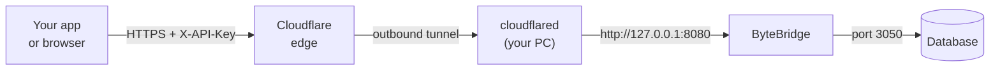

# ByteBridge

<a href="#support-the-project"></a>

A Windows desktop app that puts a small, authenticated HTTP API in
front of your databases, so they can be reached from outside
the machine through a tunnel such as Cloudflare Tunnel — without
exposing the database port or touching the router.

You add your database connections in the window, turn the ones you
want Online, and the app serves them as JSON over `127.0.0.1`.
`cloudflared` runs on the same machine and forwards to it.



Nothing listens on your LAN and no inbound port is opened: `cloudflared`
dials out to Cloudflare, and the gateway itself only ever binds to
loopback.

**Requirements:** a database server — Firebird 4 (default port 3050) or
PostgreSQL (5432). Both are tested against a real server, and both hold
`/query` read-only themselves. See
[Database engines](docs/reference/database-engines.md).

**Not a developer?** The [picture guide](docs/guide/README.md) walks
through setting ByteBridge up step by step, with no technical
background needed — also [in Arabic](docs/ar/README.md). In the app,
**Help → User Guide** (or **F1**) opens it.

## Install

Grab an installer from the
[latest release](https://github.com/kenanwahbeh/ByteBridge/releases/latest).

| File | .NET | Use it when |
| ---- | ---- | ----------- |
| `ByteBridge-<version>-x64-setup.exe` | included | **Start here.** Normal desktop install. |
| `ByteBridge-<version>-x64.msi` | included | Group Policy, Intune, or a scripted rollout. |
| `ByteBridge-<version>-x64-framework-setup.exe` | fetched | Much smaller download; Setup installs the runtime if the machine lacks it. |
| `ByteBridge-<version>-x64-framework.msi` | required | Scripted rollout where the runtime is managed separately. |

The `-framework` builds need the
[.NET 10 Desktop Runtime (x64)](https://dotnet.microsoft.com/download/dotnet/10.0);
the `-framework` **.exe** downloads and installs it when it is missing,
while the `.msi` expects your deployment tool to handle it. The bundled
builds need nothing else installed.

Both `.exe` installers also offer to install `cloudflared`, skipping the
offer when it is already present. That gets you the connector; pointing
it at a tunnel still needs your own token, which is the whole point —
see [GATEWAY.md](GATEWAY.md).

Every file also carries a signed statement of where it was built, which
the GitHub CLI can check before you run anything:

```
gh attestation verify ByteBridge-<version>-x64-setup.exe --repo kenanwahbeh/ByteBridge
```

Requires 64-bit Windows 8.1 or later. All installers are per-machine
and ask for administrator rights once.

### Silent install

Both `.exe` installers accept Inno Setup's standard silent switches:

```
ByteBridge-<version>-x64-setup.exe /VERYSILENT /SUPPRESSMSGBOXES /NORESTART
```

The `.msi` files install unattended the standard MSI way:

```
msiexec /i ByteBridge-<version>-x64.msi /quiet /norestart
```

In silent mode, missing prerequisites (the .NET Desktop Runtime,
`cloudflared`) are downloaded and installed automatically instead of
prompting — there is nobody to answer a prompt during an unattended
rollout.

## It runs as a service

The gateway is a Windows service, `ByteBridge`, installed and started
for you. It starts with the machine and serves with nobody signed in,
so an unattended server is a supported target and closing the window
does not take the gateway down with it.

The window is a control panel for that service. It shows two things
separately, because they are not the same: whether Windows is running
the service, and whether the gateway is actually answering, which it
checks by calling `/health` over loopback. A running service whose
gateway could not bind is exactly what is behind a `502`, so it is
named rather than reported as healthy.

It asks for administrator rights, because
`C:\ProgramData\ByteBridge` holds your database passwords beside the
API key, and that key is all that stands between the public internet
and those databases. The secrets are encrypted at rest with a key that
never leaves the machine, but on the running machine any administrator
can still read them, so the folder is restricted to Administrators and
the service account, and no other account on the machine can read it.

### Windows Server Core

Server Core has no desktop, so the control panel cannot run there. The
service executable doubles as an admin tool:

```
ByteBridge.Service.exe status
ByteBridge.Service.exe db add --name Sales --server 127.0.0.1 ^
    --path C:\data\sales.fdb --user SYSDBA --password secret
ByteBridge.Service.exe key show
ByteBridge.Service.exe port 8080
```

Changes apply within a few seconds; the service does not need
restarting. Run `ByteBridge.Service.exe --help` for the full list. On a
machine with a desktop you never need any of this.

## Quick start

1. **Add a database.** Choose **File → New Database…**, fill in the
   database server, port, user, password and database path or alias,
   and use **Test Connection** before saving.
2. **Check it is Online.** A connection saved after a successful test
   is Online straight away, and only Online connections answer
   requests. The button on its card takes it **Offline** and back; going
   Online tests the connection first and stays Offline if that fails.
3. **Check the gateway.** The status line under the menu bar should
   read *● Answering — http://127.0.0.1:8080 · Service: running*. Open
   **Web Server** from the menu bar and press **Copy API Key**.
4. **Start the tunnel.**

   ```
   cloudflared tunnel --url http://127.0.0.1:8080
   ```

5. **Confirm the whole path.** `/health` needs no key, so it is the
   first thing to try:

   ```
   curl https://<your-hostname>/health
   ```

   ```json
   { "status": "ok", "service": "ByteBridge", "connections": 1, "online": 1, ... }
   ```

6. **Query.**

   ```bash
   curl -X POST https://<your-hostname>/query \
     -H "X-API-Key: <your key>" \
     -H "Content-Type: application/json" \
     -d '{ "database": "Sales", "sql": "SELECT ID, NAME FROM CUSTOMERS WHERE ID = @id", "parameters": { "id": 42 } }'
   ```

## The API

| Method | Path | Auth |
| ------ | ---- | ---- |
| GET | `/health` | no |
| GET | `/databases` | yes |
| POST | `/query` | yes — `SELECT` / `WITH` only |

[**GATEWAY.md**](GATEWAY.md) has the request and response shapes, the
Firebird-to-JSON type mapping, the status codes, a named-tunnel
`config.yml`, and a troubleshooting section.

## Security

The tunnel makes this reachable from the public internet, so treat the
API key as a database credential.

- Every endpoint except `/health` requires the key, in `X-API-Key` or
  as `Authorization: Bearer`. It is 32 random bytes, generated on first
  run and compared in constant time. When Cloudflare login is set up in
  ByteBridge, a valid session from that login is accepted instead on
  every endpoint but `/stats`, which always needs the key. Cloudflare
  Access in front of the tunnel is a separate layer and does not replace
  that check.
- **New Key** rotates it without restarting the gateway. The running
  gateway picks the new key up within a few seconds, and from then on
  every client still sending the old one is refused.
- Send values in `parameters`, never concatenated into `sql`; they are
  bound as Firebird parameters, so a value cannot become SQL.
- ByteBridge only reads until an administrator ticks **Options → Allow
  writing**. `/query` refuses anything that is not a `SELECT` or `WITH`
  either way, and runs what it accepts in a transaction that Firebird
  itself holds read-only, so a statement sent to it cannot change rows.
  Generators change outside transactions, so `GEN_ID` with a step other
  than 0 and `NEXT VALUE FOR` are refused as well; a procedure that
  moves one inside its own body can only be stopped by limiting the
  Firebird user. While writing is off, `/execute` answers `403`. While
  it is on, anyone holding the API key, or signed in through ByteBridge's
  Cloudflare login, can run any statement: change and delete data and
  change the structure of your databases. Cloudflare Access in front of
  the tunnel is an extra layer, not a replacement for the key. Leave
  writing off unless you need it, and turn it off again afterwards.
- The listener binds to `127.0.0.1` only, and a request body over 1 MB
  is refused.
- Anything holding the key can read whatever the Firebird user of an
  Online connection can read. If the data is sensitive, put
  [Cloudflare Access](https://developers.cloudflare.com/cloudflare-one/policies/access/)
  in front of the hostname as well, so callers are authenticated at
  Cloudflare's edge before a request reaches the machine at all.
  [GATEWAY.md](GATEWAY.md#locking-the-tunnel-to-just-you) has the setup.
- Every request, served or rejected, is appended to
  `C:\ProgramData\ByteBridge\logs\`. Bound parameter values are never
  written; the statement is.

Connections are stored in
`C:\ProgramData\ByteBridge\bytebridge.db`. Firebird passwords and the
API key are encrypted with a key that never leaves the machine and is
kept *outside* the data folder — DPAPI on Windows; on Linux an
owner-only key file in `/var/lib/bytebridge-keys`, a sibling of the
data folder — so a copy of the data folder alone, from a backup or a
stolen file, opens nothing. A full-machine image (a disk clone, a VM
snapshot) still contains both halves on either OS and stays
decryptable, so treat those images as credentials too. And on the
running machine itself an administrator can still unwrap the secrets,
which is why the folder stays restricted. See
[Moving to a new machine](docs/reference/security.md#backups-and-moving-to-a-new-machine)
for backup and recovery guidance.

## Build from source

Needs the .NET 10 SDK and Windows.

```
dotnet build ByteBridge.slnx
dotnet run --project app/ByteBridge.csproj
```

To produce the installers the way the release does, see
[`.github/workflows/release.yml`](.github/workflows/release.yml). WiX
and Inno Setup both only run on Windows.

For how the projects fit together, see
[docs/developers/architecture.md](docs/developers/architecture.md).

## Tests

```
dotnet test tests/ByteBridge.Tests
```

The suite drives the gateway over a real socket on a spare port, with
its settings in a temporary folder, so it never reads or overwrites the
connections of whoever is running it.

| Area | What it covers |
| ---- | -------------- |
| `GatewayServerTests` | Routing, the API key, CORS, body validation, the read-only guard, the size cap, and that an early reply leaves the connection usable. |
| `GatewayLifecycleTests` | Start, stop, restart, a port already in use, key rotation, and connection changes taking effect without a restart. |
| `SqliteDatabaseTests` | Storage, duplicate details and names, gateway settings including the loopback-only host, and a key rotation surviving another writer's save. |
| `FirebirdExecutorTests` | The read-only guard on its own, including comments, word boundaries and unterminated blocks. |
| `FirebirdIntegrationTests` | A real server end to end: type mapping, NULLs, UTF-8, parameter binding, the row cap, writes, and concurrency. |
| `DatabaseTypeTests` | Engine names, each engine's usual port, connection keys, and a settings file from before engines existed opening as Firebird. |
| `EngineAndSecretsTests` | The engine column and secret protection together: a PostgreSQL password still wrapped, a pre-engine file migrating both, and a row naming an engine this build lacks still reading. |
| `PostgreSqlIntegrationTests` | PostgreSQL end to end against a real server: types, NULLs, parameter binding, the row cap, the engine refusing an INSERT and a second statement, sequences untouched, and `/execute` both ways. |
| `CliTests` | The Server Core commands: status, on and off, the port, showing and replacing the key, and adding, enabling, disabling and removing a database. |
| `RequestLogTests` | The log file itself: one JSON line per request, parameter values kept out, long statements truncated, concurrent writes, and pruning old files. |
| `RequestLoggingTests` | The log as the running gateway fills it: served and refused requests, the statement and connection, the forwarded client address, and every request landing exactly once under load. |
| `SharedDatabaseTests` | The settings file open in two processes at once: WAL mode, one seeing what the other wrote, a write waiting for a lock, and both writing together. |

`FirebirdIntegrationTests` is skipped unless you point it at a server,
so a fresh clone still gets a green run:

```powershell
$env:BYTEBRIDGE_TEST_FIREBIRD = "127.0.0.1:3050:SYSDBA:masterkey:C:\db\test.fdb"
dotnet test tests/ByteBridge.Tests
```

It creates its own `EFS_TEST_CUSTOMERS` table and works only on rows it
owns, but point it at a scratch database rather than anything real.

`PostgreSqlIntegrationTests` works the same way, and has its own CI job:

```powershell
$env:BYTEBRIDGE_TEST_POSTGRES = "127.0.0.1:5432:postgres:password:shop"
dotnet test tests/ByteBridge.Tests --filter Category=PostgreSql
```

[CI](.github/workflows/ci.yml) runs on every push and pull request, in
three jobs: the build and the whole suite on `windows-latest`, where the
live tests skip for want of a server, and — on `ubuntu-latest` — the
Firebird tests and the PostgreSQL tests against each engine in a service
container. The test project targets plain `net10.0`, so it runs on Linux
unchanged even though the app itself is Windows-only.

## Versioning

Version numbers are [semantic](https://semver.org/): `MAJOR.MINOR.PATCH`.
For this app that means:

| Bump | When |
| ---- | ---- |
| **MAJOR** | Something that breaks an existing caller: an endpoint or response field removed or renamed, a response shape changed, the authentication scheme changed, or a settings file an older version can no longer read. |
| **MINOR** | New behaviour an existing caller can ignore: a new endpoint, an extra response field, a new option in the window. |
| **PATCH** | Fixes and internal work with no visible change to the API or the UI. |

Anything worth mentioning goes into [CHANGELOG.md](CHANGELOG.md) under
**Unreleased** as it is made, so cutting a release is never a
remembering exercise.

## Releasing

1. Check that the **Unreleased** section of
   [CHANGELOG.md](CHANGELOG.md) describes what is about to ship.
2. Cut the release:

   ```
   pwsh scripts/new-release.ps1 -Version 1.0.0
   ```

   That promotes Unreleased to `## [1.0.0]` with today's date, opens a
   fresh Unreleased section, rewrites the comparison links, commits the
   changelog and creates the `v1.0.0` tag. It refuses to run on an
   empty Unreleased section, an existing tag, or a version that is not
   semantic, and it pushes nothing.
3. Publish:

   ```
   git push origin HEAD --follow-tags
   ```

   The tag starts the release workflow, which builds all four
   installers on Windows, copies that version's changelog section into
   the release body, writes `SHA256SUMS.txt`, and attaches everything
   to a GitHub Release. A tag whose version has no changelog section
   fails the build rather than publishing a release with no notes.

To test the packaging without publishing anything, run the **Release**
workflow manually from the Actions tab. It builds the same four
installers, prints the release body it would have used, and leaves the
files as workflow artifacts — no tag, no release.

## Support the project

ByteBridge is free and stays free. If it is useful to you, you can
support the work that keeps it going: maintenance, testing against real
Firebird servers, documentation, and the next round of improvements. It
is entirely optional, and nothing in the app is held back from people
who skip it.

**Binance Pay.** Scan this in the Binance app. It is an in-app code, so a
general-purpose QR reader or a desktop browser will not open it — the
Binance app is what it is for. Check that it shows **Kinan125** as the
recipient before confirming anything.


No Binance account? You can get the app through
[this referral link](https://www.binance.com/referral/earn-together/refer2earn-usdc/claim?hl=en&ref=GRO_28502_B3CAV&utm_source=referral_entrance&utm_medium=web_share_copy).
It is a referral link, so signing up with it credits this project under
Binance's referral programme at no cost to you. An ordinary signup at
binance.com works exactly the same for everything below.

**USDT on TRON (TRC20).**

```
TBFPWgdUeABgwTX5R7Cvha8ffFouuk2jDt
```

Send only USDT, and only over the **TRON (TRC20)** network. Anything sent
on a different network, or as a different asset, is not recoverable.

That is a receiving address and nothing more. Nobody working on this
project will ever ask you for a private key, a seed phrase, a password,
or the credentials to an exchange account.
