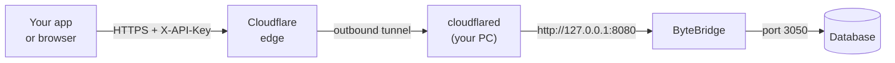

# Introduction

A Windows desktop app that puts a small, authenticated HTTP API in
front of your databases, so they can be reached from outside the
machine through a tunnel such as Cloudflare Tunnel — without exposing
the database port or touching the router.

You add your database connections in the window, turn the ones you
want Online, and the app serves them as JSON over `127.0.0.1`.
`cloudflared` runs on the same machine and forwards to it.

Nothing listens on your LAN and no inbound port is opened: `cloudflared`
dials out to Cloudflare, and the gateway itself only ever binds to
loopback.

**Requirements:** a Firebird database server (tested against Firebird
4; the default port is 3050). Other database engines may be added in
future versions.

Start with [Installation](getting-started/installation.md), then the
[Quick start](getting-started/quick-start.md) walkthrough.
