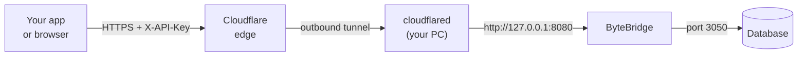

# Introduction

A Windows desktop app that puts a small, authenticated HTTP API in
front of your databases, so they can be reached from outside the
machine through a tunnel such as Cloudflare Tunnel — without exposing
the database port or touching the router.

You add your database connections in the window, turn the ones you
want Online, and the app serves them as JSON over `127.0.0.1`.
`cloudflared` runs on the same machine and forwards to it.

```mermaid
flowchart LR
    C["Your app<br/>or browser"] -->|"HTTPS + X-API-Key"| E["Cloudflare<br/>edge"]
    E -->|"outbound tunnel"| D["cloudflared<br/>(your PC)"]
    D -->|"http://127.0.0.1:8080"| G["ByteBridge"]
    G -->|"port 3050"| F[("Database")]
```

Nothing listens on your LAN and no inbound port is opened: `cloudflared`
dials out to Cloudflare, and the gateway itself only ever binds to
loopback.

**Requirements:** a database server — Firebird 4 (the default, port
3050) or PostgreSQL (5432). Both are tested against a real server, and
both hold `/query` read-only themselves. See
[Database engines](reference/database-engines.md).

## Where to start

| You are… | Start here |
| --- | --- |
| Setting ByteBridge up on your computer, with no programming background | [Getting started, in pictures](guide/README.md) |
| تُعدّ ByteBridge على جهازك دون خبرة في البرمجة، وتفضّل العربية | [البداية بالصور](ar/README.md) |
| An administrator or developer connecting to the API | [Installation](getting-started/installation.md), then the [Quick start](getting-started/quick-start.md) |
| Working on ByteBridge's own code | [How the code fits together](developers/architecture.md) |

**Help → User Guide** (or **F1**) in the app opens the picture guide in
the language the window is using.

## Who makes it

ByteBridge is developed by **ByteBalanceTech** —
[bytebalancetech.com](https://bytebalancetech.com). In the app,
**Help → Visit ByteBalanceTech.com** opens the site, and
**Help → About ByteBridge** shows the version and the maker.

 
