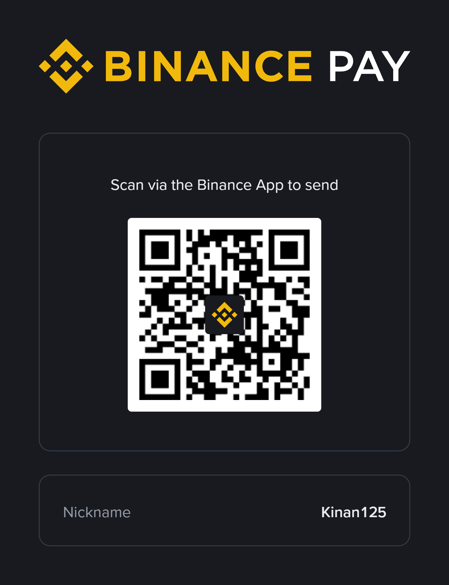

# Support the project

ByteBridge is free and stays free. If it is useful to you, you can
support the work that keeps it going: maintenance, testing against real
Firebird servers, documentation, and the next round of improvements. It
is entirely optional, and nothing in the app is held back from people
who skip it.

**Binance Pay.** Scan this in the Binance app. It is an in-app code, so a
general-purpose QR reader or a desktop browser will not open it — the
Binance app is what it is for. Check that it shows **Kinan125** as the
recipient before confirming anything.



No Binance account? You can get the app through
[this referral link](https://www.binance.com/referral/earn-together/refer2earn-usdc/claim?hl=en&ref=GRO_28502_B3CAV&utm_source=referral_entrance&utm_medium=web_share_copy).
It is a referral link, so signing up with it credits this project under
Binance's referral programme at no cost to you. An ordinary signup at
binance.com works exactly the same for everything below.

**USDT on TRON (TRC20).**

```
TBFPWgdUeABgwTX5R7Cvha8ffFouuk2jDt
```

Send only USDT, and only over the **TRON (TRC20)** network. Anything sent
on a different network, or as a different asset, is not recoverable.

That is a receiving address and nothing more. Nobody working on this
project will ever ask you for a private key, a seed phrase, a password,
or the credentials to an exchange account.
