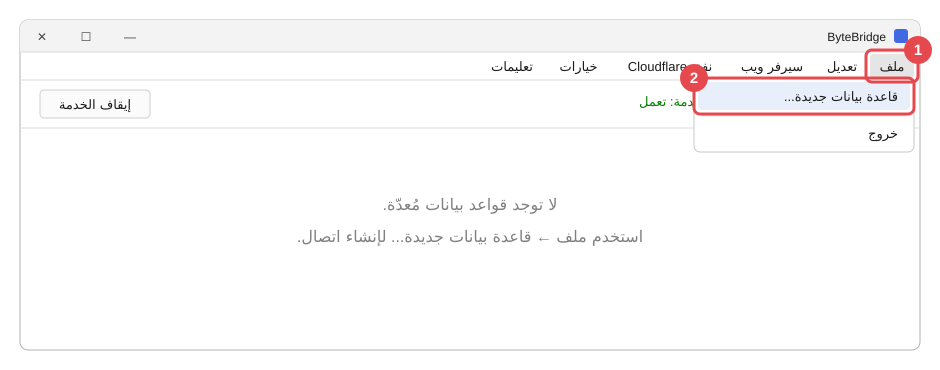
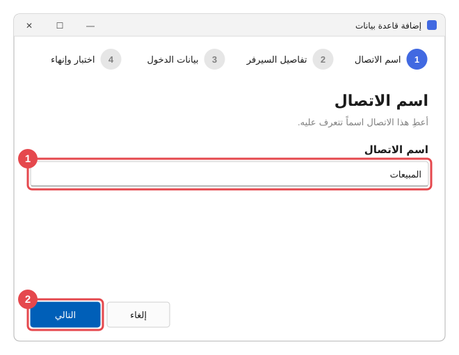
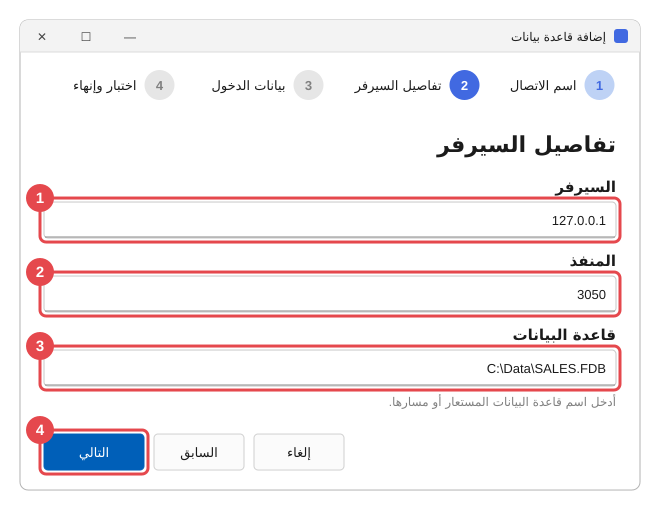
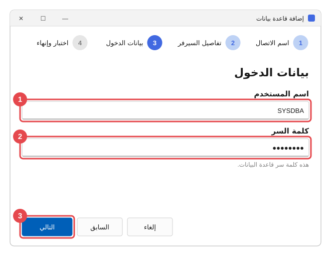
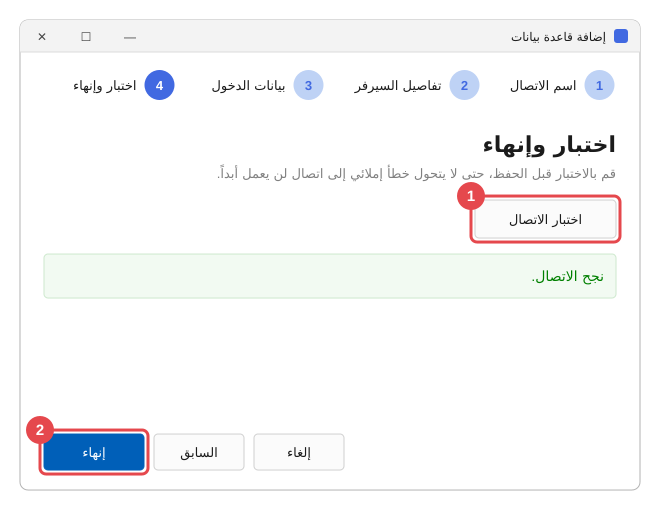
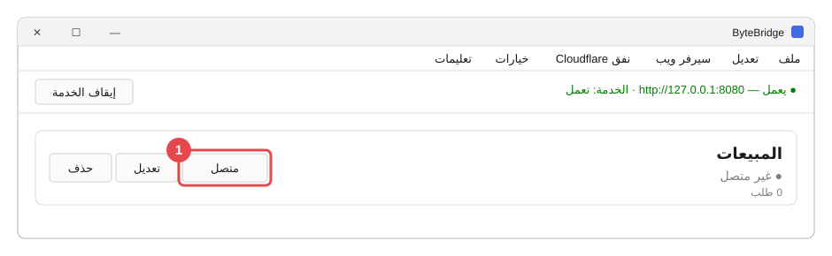
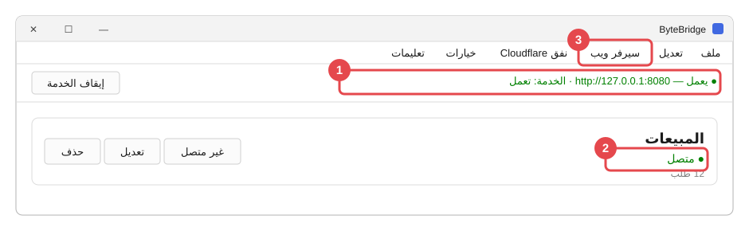
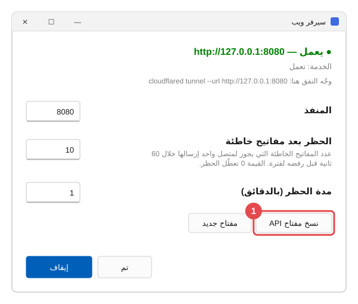
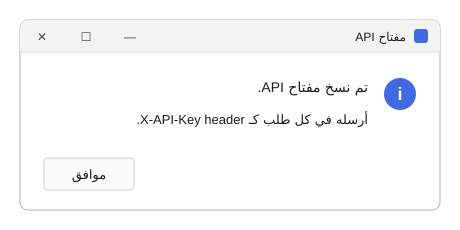

# البداية بالصور

**ByteBridge** من تطوير **ByteBalanceTech** —
[bytebalancetech.com](https://bytebalancetech.com)

 

خمس خطوات تأخذك من ByteBridge مثبّت حديثاً إلى قاعدة بيانات يستطيع
المطوّر استخدامها. اتبع الأرقام الحمراء في كل صورة: فهي تُظهر على ماذا
تضغط، وبأي ترتيب.

*الصور تستخدم قاعدة بيانات مثال اسمها* المبيعات*. أسماؤك ومساراتك
ستكون مختلفة.*

---

## الخطوة 1 — ابدأ بإضافة قاعدة بيانات

افتح قائمة **ملف** (**1**) واختر **قاعدة بيانات جديدة...** (**2**).

---

## الخطوة 2 — املأ الصفحات الأربع

يفتح معالج قصير. الدوائر في أعلاه تُظهر في أي صفحة أنت.

**الصفحة 1 — اسم الاتصال.** اكتب اسماً تعرفه (**1**)، ثم اضغط
**التالي** (**2**). أخبر المطوّر بهذا الاسم؛ فهو سيستخدمه.

**الصفحة 2 — تفاصيل السيرفر.** أين توجد قاعدة البيانات (**1**، **2**،
**3**)، ثم **التالي** (**4**).

| الخانة | ماذا تكتب |
| --- | --- |
| **السيرفر** | `127.0.0.1` إن كانت قاعدة البيانات على هذا الجهاز. وإلا فاسم الجهاز الذي يحملها. |
| **المنفذ** | اترك `3050` إلا إذا قيل لك رقم آخر. |
| **قاعدة البيانات** | المسار الكامل لملف قاعدة البيانات، وغالباً ينتهي بـ `.fdb`. |

**الصفحة 3 — بيانات الدخول.** اسم المستخدم الخاص بقاعدة البيانات
(**1**) وكلمة سرها (**2**)، ثم **التالي** (**3**).

> **ملاحظة:** لست متأكداً ماذا تكتب في الصفحتين 2 و3؟ الشخص أو الشركة التي ثبّتت
> برنامج عملك تملك هذه التفاصيل. اطلب منهم "بيانات اتصال Firebird".

**الصفحة 4 — اختبار وإنهاء.** اضغط **اختبار الاتصال** (**1**). عندما
يظهر **نجح الاتصال.** باللون الأخضر، اضغط **إنهاء** (**2**).

إن فشل الاختبار، اضغط **السابق** وراجع ما كتبت. الرسالة تخبرك بالخطأ —
راجع [عندما تحدث مشكلة](when-something-is-wrong.md).

---

## الخطوة 3 — اجعلها متصلة

أصبح لقاعدة بياناتك بطاقة، ومكتوب عليها **غير متصل**. اضغط **متصل**
على البطاقة (**1**) ثم أكّد.

---

## الخطوة 4 — تأكّد أن كل شيء أخضر

1. السطر في الأعلى يقول **● يعمل** و**الخدمة: تعمل**، باللون الأخضر.
2. البطاقة تقول **● متصل**، باللون الأخضر.

إن لم يكن أحدهما أخضر، راجع [عندما تحدث مشكلة](when-something-is-wrong.md).

---

## الخطوة 5 — أعطِ المطوّر المفتاح

افتح **سيرفر ويب** من شريط القوائم (**3** في الصورة السابقة). اضغط
**نسخ مفتاح API** (**1**).

يؤكد ByteBridge أن المفتاح نُسخ. اضغط **موافق**.

الآن الصقه (**Ctrl+V**) في رسالة **خاصة** إلى المطوّر، ومعه اسم الاتصال
من الخطوة 2.

> **مهم:** المفتاح يفتح قاعدة بياناتك لمن يملكه. لا تنشره أبداً في مجموعة دردشة أو
> في رسالة لعدة أشخاص. إن كان قد تسرّب، اضغط **مفتاح جديد** في النافذة
> نفسها وأرسل الجديد.

---

## انتهيت

ByteBridge يبقى يعمل في الخلفية، حتى عندما تغلق النافذة أو لا يكون أحد
مسجّلاً الدخول إلى الجهاز. فقط أبقِ الجهاز شغّالاً.

تريد أن تعرف أكثر؟

- [ما هو ByteBridge؟](what-it-does.md) — الفكرة ببساطة.
- [استخدام ByteBridge يومياً](everyday-use.md) — شرح كل زر وخيار.
- [عندما تحدث مشكلة](when-something-is-wrong.md) — معنى الرسائل وماذا
  تفعل.
