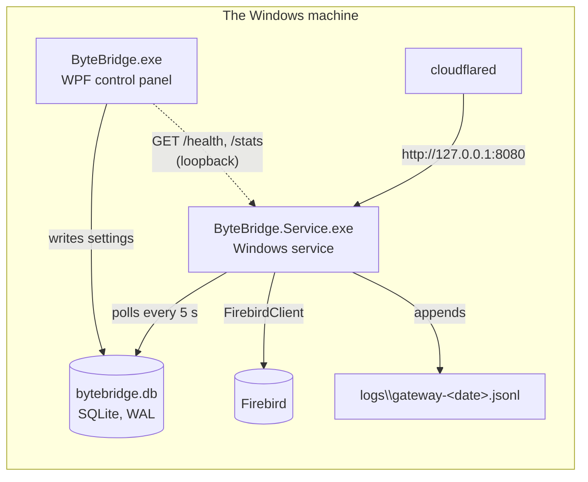

# How the code fits together

This page is the map a new contributor needs before opening any file:
what the projects are, which process does what, how they talk, and
where a given change belongs. For building and running the tests, see
[Building and testing](../contributing/building-and-testing.md); for
the HTTP contract itself, the [API reference](../reference/api-reference.md).

## The one-paragraph version

ByteBridge is three .NET projects around one SQLite file. A **Windows
service** hosts an `HttpListener` on loopback that turns JSON requests
into Firebird queries. A **WPF control panel** edits the settings the
service runs from. Neither talks to the other: both open
`C:\ProgramData\ByteBridge\bytebridge.db`, the panel writes, and the
service notices within five seconds. Everything that is not UI or
service hosting lives in a portable **core** library, which is also
what the tests exercise.

## The projects

| Project | Path | Target | What it is |
| --- | --- | --- | --- |
| `ByteBridge` | `app/` (`*.xaml`, `*.cs`) | `net10.0-windows`, WPF + WPF-UI | The control panel. Runs elevated (`app.manifest`), one copy per Windows session, lives in the tray. |
| `ByteBridge.Core` | `core/` | `net10.0` | The gateway, the Firebird executor, storage, the request log, localisation, and the admin CLI. No Windows APIs, so the tests run on Linux. |
| `ByteBridge.Service` | `service/` | `net10.0-windows` | The service host. With no arguments it is the service; with arguments it is the admin CLI (`Cli.Run`) for Server Core. |
| `ByteBridge.Tests` | `tests/ByteBridge.Tests/` | `net10.0` | xUnit. Drives a real listener on a spare port against a temporary data folder. |

One thing at the root is **not** part of the product:

- `installer/` — the Inno Setup (`.exe`) and WiX (`.msi`) definitions,
  built only by the release workflow.

The app project lives in `app/`, so the SDK's default glob only ever
picks up that project's own sources. There is no exclusion list to
maintain: a new project directory anywhere else in the repo cannot
leak into the app's build.

## Where things live in `core/`

| Folder | Holds |
| --- | --- |
| `Gateway/GatewayServer.cs` | The listener: routing, auth, CORS, body limits, JSON shapes, the Cloudflare Access login routes. |
| `Gateway/SqlProviders.cs` | One engine, behind the four things the gateway needs from it: open a connection, run a query that cannot write, run a statement that can, and say whether an error is the database's own. The row cap, parameter binding and JSON values are written once, here. `SqlProviders.For` picks the engine, and refuses a connection whose stored engine this build has no provider for. `internal` — callers go through `GatewayServer`. |
| `Gateway/FirebirdExecutor.cs` | Now only the text guard `IsReadOnlyStatement` / `AdvancesSequence` plus its tests, delegating execution to `FirebirdProvider`. It keeps its name because the guard is engine-independent and predates the providers. |
| `Gateway/AuthFailureLimiter.cs` | The wrong-key lockout, keyed by `CF-Connecting-IP`. |
| `Gateway/CloudflareAccessValidator.cs`, `OAuthSessionManager.cs` | Optional Cloudflare Access (JWT) sign-in and the session cookie it produces. |
| `Gateway/ConnectionHealthMonitor.cs` | Probes every enabled connection once a minute so "online" reflects now. Skips a connection whose engine this build cannot serve. |
| `Gateway/RequestLog.cs` | One JSON line per request, written after the response; parameter values never logged. |
| `data/SqliteDatabase.cs` | The only thing that touches `bytebridge.db`: connections, gateway settings, OAuth settings, sessions. Wraps and unwraps the stored secrets, so callers deal in plaintext. |
| `data/DataFolderSecurity.cs` | Restricts the data folder to SYSTEM and Administrators, on every open. |
| `data/DatabaseConnectionTester.cs` | Whether a connection's details work, through its own engine's provider. |
| `Security/` | `ISecretProtector` and its two implementations: DPAPI on Windows, an AES key file outside the data folder on Linux. |
| `Configuration/` | Plain records: `DatabaseConfig`, `GatewayConfig`, `OAuthConfig`, `DatabaseType`. |
| `Localization/Strings.cs` | Every UI string, English and Arabic. |
| `Admin/Cli.cs` | The `ByteBridge.Service.exe <command>` admin tool. |

## The life of a request

Take `POST /query` arriving through the tunnel:

1. `cloudflared` forwards it to `http://127.0.0.1:<port>/`. The
   listener never binds anything but loopback; the service reserves
   that prefix with HTTP.SYS itself (`service/UrlReservation.cs`) the
   first time a bind is refused.
2. `GatewayServer` checks the size cap (1 MB) and CORS, and answers
   `/health` without a key.
3. The caller's address (`CF-Connecting-IP`, never
   `X-Forwarded-For`) is checked against `AuthFailureLimiter`; a locked
   out caller gets `429` before its key is even read.
4. The key (`X-API-Key` or `Authorization: Bearer`) is compared in
   constant time. With Cloudflare Access enabled, a session cookie is
   accepted instead. The Access JWT itself is never accepted here: it
   is validated once, at `/auth/callback`, which creates that session.
5. The connection is looked up **from SQLite, on this request** — so
   toggling Online/Offline in the panel applies immediately. Unknown
   name → `404`; Offline → `409`; an engine this build cannot serve →
   `409` naming the engine, which is a configuration problem rather than
   a database error.
6. `FirebirdExecutor` refuses anything but `SELECT`/`WITH`, and refuses
   a statement that moves a sequence. Then `SqlProviders.For` picks the
   connection's engine: that provider binds `parameters`, opens the
   read-only transaction **its engine understands**, runs it, and maps
   rows to JSON. The text check is a courtesy on both engines — the
   transaction is what refuses a write — which is why it lives here and
   the enforcement lives in each provider.
7. The response is written, and only then is a line appended to the
   request log.

## How the panel and the service stay in step

There is deliberately no IPC. The panel writes to SQLite (WAL mode, so
both processes can hold it open) and `service/GatewayWorker.cs`
re-reads the gateway settings every five seconds. A changed port or
on/off switch rebinds the listener; a changed API key, lockout or
Access setting is handed to the running listener without a rebind.
Connections are different: the gateway reads them on every request, so
they need no poll at all. The consequence to keep in mind: **a setting takes effect when
the service next polls, not when the button is clicked**, which is why
the panel refreshes its status on a two-second timer instead of
trusting its own clicks.

What the panel *does* ask the service, it asks over HTTP on loopback,
the same way a tunnel would: `/health` to tell "the service is
running" apart from "the gateway is answering"
(`GatewayServiceControl.cs`), and `/stats` for the request counts on
each card. Starting and stopping the service goes through the Service
Control Manager (`GatewaySwitch.cs`).

## The control panel

| File | Screen |
| --- | --- |
| `App.xaml.cs` | Start-up: single-instance mutex per session, language, the tray icon. |
| `MainWindow.xaml(.cs)` | Menu bar, status line, one card per connection. Cards are built in code (`CreateConnectionCard`). |
| `AddDatabaseWizardWindow` | The four-step add/edit wizard, with Test Connection. Step 1 picks the engine, which moves the port and user to that engine's usual ones while they still hold the previous one's. |
| `WebServerWindow` | Gateway on/off, port, API key copy/rotate, lockout settings. |
| `CloudflareTunnelWindow` | Cloudflare Access (OAuth) settings. |
| `SettingsWindow` | Options: language, start with Windows, ask before closing. |
| `AboutWindow`, `CloseDialogWindow` | About (maker, version, log folder) and the close prompt. |

Windows set `FlowDirection` from `Strings.CurrentLanguage`, so Arabic
mirrors the whole layout; nothing else is needed for RTL.

## Common changes, and where they go

**A new UI string.** Add the key to both the `"en"` and `"ar"`
dictionaries in `core/Localization/Strings.cs`, then set it from the
window's `ApplyLocalization` (or equivalent) with `Strings.Get`. A
missing Arabic entry falls back to English rather than failing, so
check both are there.

**A new setting.** Add the field to the right record in
`core/Configuration/`, read and write it in `SqliteDatabase`
(`GetGatewayConfig` / `SaveGatewayConfig` use the key–value `settings`
table, so no schema change is needed), expose it in the window and in
`core/Admin/Cli.cs` so Server Core can reach it too, and — if the
running listener has to react — compare it in `GatewayWorker`.

**A new stored secret.** Add its settings key to
`SqliteDatabase.ProtectedSettingKeys`. `GetSetting` and `SetSetting`
wrap and unwrap it transparently, so nothing else changes — and nothing
else may write it raw. A value already in the file unwrapped is migrated
on the next open, and the migration then checkpoints and rebuilds the
database so the plaintext does not survive in a page.

**A new endpoint.** Route it in `GatewayServer` and decide explicitly
whether it needs the key. Data endpoints do. The exceptions today are
`/health` and the sign-in routes (`/auth/login`, `/auth/callback`,
`/auth/logout`), which are dispatched before authentication because
they have to work for someone who has not signed in yet. Record it
in the request log, add tests in `GatewayServerTests`, and document it
in `docs/reference/api-reference.md` and `GATEWAY.md`. A new endpoint
is a MINOR version bump.

**Another database engine.** Add a `DatabaseType`, its defaults in
`DatabaseTypes`, and a `SqlProvider` subclass in `SqlProviders.cs` —
four members: how to open a connection, how to begin a transaction that
the engine itself holds read-only, whether an error is the database's
own, and (only where the engine leaves a gap) a `RejectQuery` text
check. Everything shared is already written once, so there is nothing to
duplicate. `DatabaseConfig.Type` already exists, so a row naming the new
engine reads and dispatches with no storage change.

Two things decide whether an engine is ready. Its transaction must
hold `/query` read-only **itself**, so a statement that got past the
text check is still refused by the database — without that, a text
check is the whole of the protection. And it must have run against a
real server in CI, not only against unit tests. SQL Server was written
and then taken back out for failing the first, and never having
satisfied the second; `docs/reference/database-engines.md` has the
reasoning.

**A change a user can see.** Update the user guide under `docs/guide/`
and `docs/ar/`, and, if a window changed, the drawings:
`python scripts/docs-screens.py` regenerates
`docs/assets/screens/{en,ar}/` from the labels in that script.

**Anything worth telling users.** A line under **Unreleased** in
`CHANGELOG.md`, as you make it. See
[Versioning and releasing](../contributing/versioning-and-releasing.md).

## Conventions

- Comments explain **why**, in full sentences, as block comments above
  the thing they describe. Read a few files before adding one.
- Security decisions are written down where they are made (the data
  folder ACL, the lockout keying, the loopback-only bind). If you change
  one, change its comment.
- Tests use `new SqliteDatabase(tempFolder)` and a spare port; never
  the machine's real data folder.
