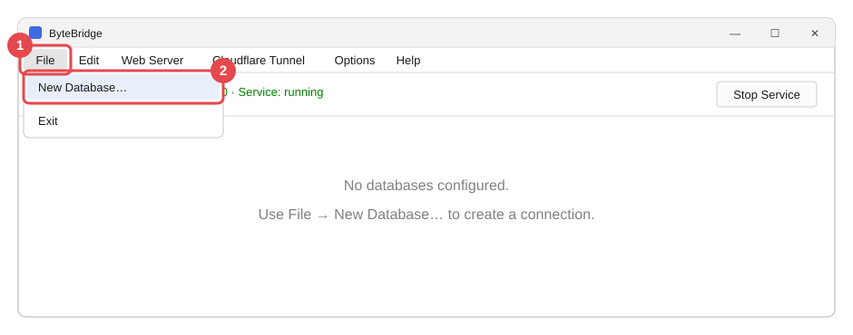
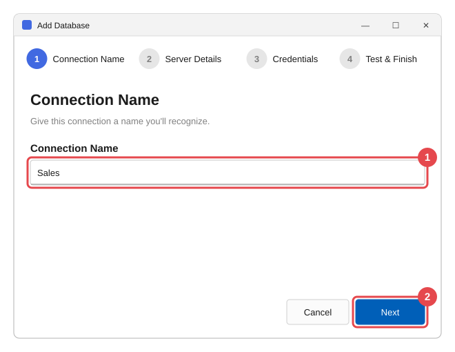
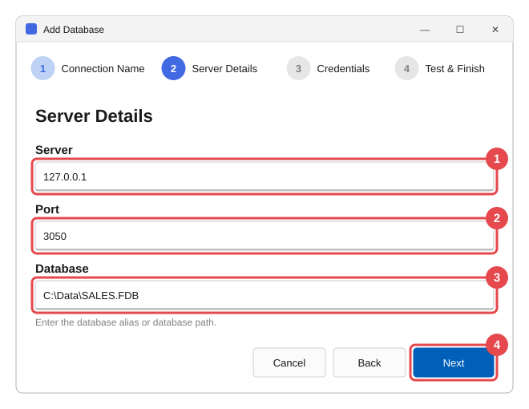
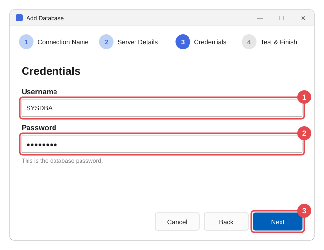
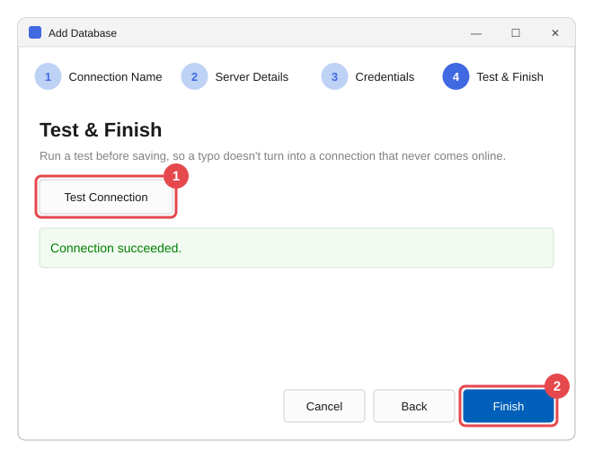
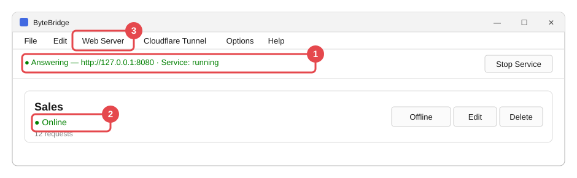
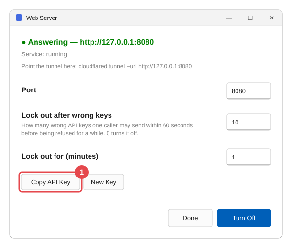
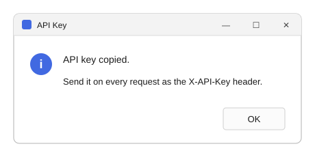

# Getting started, in pictures

**ByteBridge** is made by **ByteBalanceTech** —
[bytebalancetech.com](https://bytebalancetech.com)

 

Four steps take you from a freshly installed ByteBridge to a database
your developer can use. Follow the red numbers in each picture: they
show what to click, in order.

*The pictures use an example database called* Sales*. Your own names
and paths will be different.*

---

## Step 1 — Start adding a database

Open the **File** menu (**1**) and choose **New Database…** (**2**).

---

## Step 2 — Fill in the four pages

A short wizard opens. The circles along its top show which page you
are on.

**Page 1 — Connection Name.** Type a name you will recognise (**1**),
then press **Next** (**2**). Tell your developer this name; they will
use it.

**Page 2 — Server Details.** Where the database is (**1**, **2**, **3**),
then **Next** (**4**).

| Box | What to type |
| --- | --- |
| **Server** | `127.0.0.1` if the database is on this computer. Otherwise the name of the computer that holds it. |
| **Port** | Leave `3050` unless you were told another number. |
| **Database** | The full path of the database file, often ending in `.fdb`. |

**Page 3 — Credentials.** The database's own user name (**1**) and
password (**2**), then **Next** (**3**).

> **Tip:** Not sure what to type on pages 2 and 3? The person or company that
> installed your business software has these details. Ask them for
> "the Firebird connection details".

**Page 4 — Test & Finish.** Press **Test Connection** (**1**). When it
says **Connection succeeded.** in green, press **Finish** (**2**).

If the test fails, press **Back** and check what you typed. The
message tells you what went wrong — see
[When something is wrong](when-something-is-wrong.md#connection-failed-when-adding-or-switching-on-a-database).

---

## Step 3 — Check everything is green

Your database now has a card in the window. Because the test
succeeded, it is **Online** already — there is nothing to switch on.

1. The line at the top says **● Answering** and **Service: running**,
   in green.
2. The card says **● Online**, in green.

If either is not green, see
[When something is wrong](when-something-is-wrong.md).

> **Careful:** the button on the card says **Offline** because that is
> what pressing it *does*. Leave it alone unless you want to stop
> outside access to that database.

---

## Step 4 — Give your developer the key

Open **Web Server** from the menu bar (**3** in the picture above).
Press **Copy API Key** (**1**).

ByteBridge confirms the key is copied. Press **OK**.

Now paste it (**Ctrl+V**) into a **private** message to your developer,
together with the connection name from Step 2.

> **Important:** The key opens your database to whoever has it. Never post it in a
> group chat or an email to many people. If it may have leaked, press
> **New Key** in the same window and send the new one.

---

## You are done

ByteBridge keeps working in the background, even when you close the
window or nobody is signed in to the computer. Just keep the computer
switched on.

Want to know more?

- [What ByteBridge does](what-it-does.md) — the idea behind it, in
  everyday words.
- [Using ByteBridge day to day](everyday-use.md) — every button and
  option explained.
- [When something is wrong](when-something-is-wrong.md) — what the
  messages mean and what to do.
