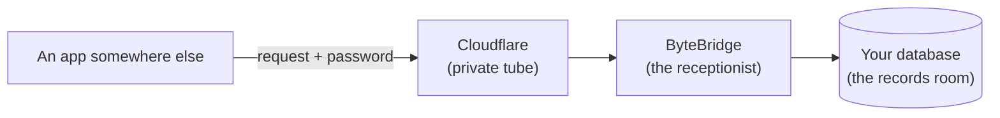

# What ByteBridge does

*This part of the guide is for people who use ByteBridge, not people who
program it. No technical knowledge is needed. If you are a developer,
the [API reference](../reference/api-reference.md) and
[How the code fits together](../developers/architecture.md) are the
pages for you.*

## The short version

Your business keeps its information — customers, invoices, stock — in a
**database** on a computer in the office. ByteBridge lets a program
somewhere else (a website, a phone app, a report built by your
developer) read and update that information **safely**, without anyone
opening your office network to the internet.

## An everyday picture

Think of your database as the **records room** at the back of a shop.

- Normally, the only way to reach the records room is to be inside the
  shop. That is safe, but it means an app on a phone in another city
  cannot see anything.
- The risky way to fix that is to knock a hole in the back wall so
  anyone outside can walk into the records room. That is what "opening
  a port on the router" means, and it is exactly what ByteBridge
  avoids.
- ByteBridge is a **receptionist** sitting at a small window inside the
  shop. Requests are passed to the receptionist, who checks the
  **password** (called the *API key*), fetches what was asked for, and
  hands back only that.
- The requests arrive through a **private delivery tube** run by a
  company called Cloudflare (the *Cloudflare Tunnel*). The tube is
  started from inside the shop, so no door is ever opened to the
  street.

## What you do, and what your developer does

| You (the owner of the computer) | Your developer or IT person |
| --- | --- |
| Install ByteBridge. | Sets up the Cloudflare tunnel. |
| Add your database and switch it **Online**. | Builds the app or website that asks ByteBridge for data. |
| Copy the **API key** and give it to your developer privately. | Keeps the key secret and uses it in every request. |
| Glance at the status line now and then. | Tells you if requests start failing. |

## Things worth knowing

- **ByteBridge keeps working when the window is closed.** The part that
  answers requests runs quietly in the background as a Windows
  *service*, and it starts on its own when the computer starts — even
  before anyone signs in. The window is only the control panel.
- **The computer must stay on.** If it is switched off or asleep, the
  app on the other end cannot reach your data.
- **The API key is like the key to your records room.** Anyone who has
  it can read and change the databases you switched Online. Share it
  only with people you trust, and never post it in a group chat.
- **Nothing is sent anywhere by ByteBridge on its own.** It only answers
  requests that arrive with the right key.

Next: [Using ByteBridge day to day](everyday-use.md).
